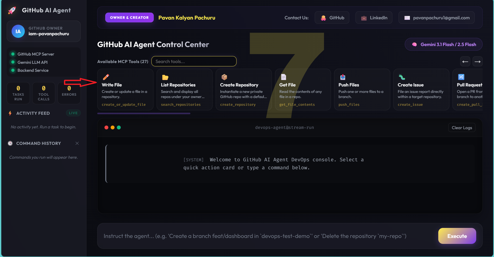

# 🚀 GitHub AI Agent — Web Dashboard

> Control your entire GitHub account through natural language. Powered by **Google Gemini**, **LangGraph ReAct**, and the **GitHub MCP Server** — with a real-time streaming dashboard UI.

**Built & maintained by [Pavan Kalyan Pachuru](https://github.com/iam-pavanpachuru)**  
📧 pavanpachuru1@gmail.com &nbsp;|&nbsp; 💼 [LinkedIn](https://www.linkedin.com/in/pavan-kalyan-pachuru-538a4016b)

---

## 📋 Table of Contents

1. [What Is This?](#-what-is-this)
2. [Architecture](#-architecture)
3. [Prerequisites](#-prerequisites)
4. [Getting Your API Keys](#-getting-your-api-keys)
5. [Local Deployment (Docker)](#-local-deployment-docker)
6. [Cloud Deployment (AWS ECR + EKS)](#-cloud-deployment-aws-ecr--eks)
7. [GitOps with ArgoCD](#-gitops-with-argocd-optional)
8. [Available MCP Tools](#-available-mcp-tools)
9. [Environment Variables Reference](#-environment-variables-reference)
10. [Project Structure](#-project-structure)
11. [Troubleshooting](#-troubleshooting)

---

## 🤖 What Is This?

**GitHub AI Agent** is a web-based DevOps dashboard that lets you control GitHub repositories using plain English commands. No CLI required — just type what you want done.

**Example commands you can run:**
```
List ALL repositories for my GitHub account
Create a branch feat/dashboard in `devops-test-demo`
Push a README.md to my `my-new-repo` repository
Create an issue titled "Fix login bug" in `my-app`
Delete the repository `test-repo`
```

**You can also use the available tools option on the page for quick prompts**



**What happens under the hood:**
- Your instruction goes to a **LangGraph ReAct agent**
- The agent reasons using **Google Gemini LLM**
- It executes actions via **27+ GitHub MCP tools** (plus a custom delete tool)
- Every step streams back to your browser **in real time**

---

## 🏗 Architecture

```
Browser (Dashboard UI)
        │
        │  HTTP / SSE streaming
        ▼
FastAPI Backend  (app.py)
        │
        ▼
LangGraph ReAct Agent
        │
        ▼
Google Gemini LLM  ──────────────────────────┐
        │                                    │
        ▼                                  reasons
   Tool Layer                                │
   ├── GitHub MCP Server (27 tools)  ◄───────┘
   └── Custom Tool: delete_repository
        │
        ▼
  GitHub REST API
        │
        ▼
  Your GitHub Account
```

| Component | Technology |
|---|---|
| Web UI | Vanilla HTML/CSS/JS — glassmorphic dashboard |
| Backend | FastAPI + Uvicorn (async Python) |
| AI Agent | LangGraph `create_react_agent` |
| LLM | Google Gemini 2.5 Flash / 3.1 Flash Lite |
| GitHub Interface | `@modelcontextprotocol/server-github` (Node.js) |
| Streaming | Server-Sent Events (SSE) |
| Container | Docker multi-stage build (Python 3.11 + Node.js 20) |
| Cloud | AWS ECR (registry) + EKS (Kubernetes) |

---

## ✅ Prerequisites

### For Local (Docker)
| Tool | Version | Install |
|---|---|---|
| Docker | 20.x+ | [docs.docker.com](https://docs.docker.com/get-docker/) |
| Git | Any | [git-scm.com](https://git-scm.com) |

### For Cloud (EKS)
| Tool | Version | Install |
|---|---|---|
| AWS CLI | v2 | [aws.amazon.com/cli](https://aws.amazon.com/cli/) |
| kubectl | 1.27+ | [kubernetes.io](https://kubernetes.io/docs/tasks/tools/) |
| eksctl | Any | [eksctl.io](https://eksctl.io) |
| Docker | 20.x+ | [docs.docker.com](https://docs.docker.com/get-docker/) |

---

## 🔑 Getting Your API Keys

You need **3 values** before running anything.

### 1. Google Gemini API Key

1. Go to [aistudio.google.com](https://aistudio.google.com)
2. Sign in with your Google account
3. Click **"Get API Key"** → **"Create API key"**
4. Copy the key — it starts with `AIza...`

> Free tier includes generous usage. No credit card required.

### 2. GitHub Personal Access Token (PAT)

1. Go to [github.com/settings/tokens](https://github.com/settings/tokens)
2. Click **"Generate new token (classic)"**
3. Give it a name, e.g. `github-ai-agent`
4. Set expiration as needed
5. Select these scopes:

   ```
   ✅ repo          (full repository access)
   ✅ workflow      (GitHub Actions)
   ✅ delete_repo   (needed for the delete tool)
   ✅ read:user     (read your username/profile)
   ```

6. Click **"Generate token"** and copy immediately — it won't be shown again

### 3. Your GitHub Username

Just your GitHub handle, e.g. `iam-pavanpachuru`

---

## 🐳 Local Deployment (Docker)

### Step 1 — Clone the repository

```bash
git clone https://github.com/iam-pavanpachuru/github-ai-agent-web.git
cd github-ai-agent-web
```

### Step 2 — Create your `.env` file

Create a file named `.env` in the project root:

```bash
# .env
GOOGLE_API_KEY=AIzaSy...your_key_here...
GITHUB_PERSONAL_ACCESS_TOKEN=ghp_...your_token_here...
GITHUB_USERNAME=your-github-username
```

> ⚠️ **Never commit this file.** It is listed in `.gitignore` by default.

### Step 3 — Build the Docker image

```bash
docker build -t github-ai-agent:latest .
```

This uses a **multi-stage build** that:
- Installs Python 3.11 dependencies
- Installs Node.js 20 + `@modelcontextprotocol/server-github` npm package
- Produces a lean runtime image

> First build takes ~3–5 minutes due to npm install. Subsequent builds use layer cache.

### Step 4 — Run the container

```bash
docker run -d \
  --name github-ai-agent \
  --env-file .env \
  -p 8000:8000 \
  github-ai-agent:latest
```

### Step 5 — Open the dashboard

```
http://localhost:8000
```

You should see the GitHub AI Agent Control Center with all status indicators green.

### Useful Docker commands

```bash
# View live logs
docker logs -f github-ai-agent

# Stop the container
docker stop github-ai-agent

# Remove the container
docker rm github-ai-agent

# Rebuild after code changes
docker build -t github-ai-agent:latest . && \
docker stop github-ai-agent && \
docker rm github-ai-agent && \
docker run -d --name github-ai-agent --env-file .env -p 8000:8000 github-ai-agent:latest
```

---

## ☁️ Cloud Deployment (AWS ECR + EKS)

### Overview

```
Local Machine
    │
    │  docker build + push
    ▼
Amazon ECR  (container registry)
    │
    │  kubectl apply
    ▼
Amazon EKS  (Kubernetes cluster)
    ├── Namespace: devops-agent
    ├── Deployment: devops-agent (1 replica)
    └── Service: LoadBalancer → port 80 → container port 8000
```

---

### Phase 1 — Push image to Amazon ECR

#### 1.1 Configure AWS CLI

```bash
aws configure
# Enter your AWS Access Key ID, Secret Access Key, region (e.g. eu-north-1), output format (json)
```

#### 1.2 Create an ECR repository (first time only)

```bash
aws ecr create-repository \
  --repository-name pavan-devops-ecr \
  --region eu-north-1
```

Note the `repositoryUri` from the output — it looks like:
```
145043400170.dkr.ecr.eu-north-1.amazonaws.com/pavan-devops-ecr
```

#### 1.3 Authenticate Docker with ECR

```bash
aws ecr get-login-password --region eu-north-1 | \
  docker login --username AWS --password-stdin \
  145043400170.dkr.ecr.eu-north-1.amazonaws.com
```

#### 1.4 Build and tag the image

```bash
docker build -t github-ai-agent:latest .

docker tag github-ai-agent:latest \
  145043400170.dkr.ecr.eu-north-1.amazonaws.com/pavan-devops-ecr:latest
```

#### 1.5 Push to ECR

```bash
docker push 145043400170.dkr.ecr.eu-north-1.amazonaws.com/pavan-devops-ecr:latest
```

> Replace `145043400170` and `eu-north-1` with your own AWS account ID and region.

---

### Phase 2 — Deploy to Amazon EKS

#### 2.1 Create the EKS cluster (first time only)

```bash
eksctl create cluster \
  --name devops-agent-cluster \
  --region eu-north-1 \
  --nodegroup-name standard-workers \
  --node-type t3.medium \
  --nodes 2 \
  --nodes-min 1 \
  --nodes-max 3 \
  --managed
```

> This takes ~15 minutes. eksctl automatically updates your `~/.kube/config`.

#### 2.2 Update kubeconfig (if cluster already exists)

```bash
aws eks update-kubeconfig \
  --region eu-north-1 \
  --name devops-agent-cluster
```

#### 2.3 Create the namespace

```bash
kubectl apply -f k8s/namespace.yaml
```

`k8s/namespace.yaml`:
```yaml
apiVersion: v1
kind: Namespace
metadata:
  name: devops-agent
```

#### 2.4 Create the Kubernetes Secret for credentials

Kubernetes needs your API keys as a Secret (not baked into the image):

```bash
kubectl create secret generic devops-agent-secret \
  --namespace devops-agent \
  --from-literal=GOOGLE_API_KEY=AIzaSy...your_key... \
  --from-literal=GITHUB_PERSONAL_ACCESS_TOKEN=ghp_...your_token... \
  --from-literal=GITHUB_USERNAME=your-github-username
```

> This is the secure way — credentials are stored encrypted in etcd, not in your image or manifests.

#### 2.5 Update the image URI in deployment.yaml

Edit `k8s/deployment.yaml` and replace the image field with your ECR URI:

```yaml
image: 145043400170.dkr.ecr.eu-north-1.amazonaws.com/pavan-devops-ecr:latest
```

The deployment uses `envFrom: secretRef` to automatically inject the credentials from the secret you created above.

#### 2.6 Apply the Kubernetes manifests

```bash
# Apply in order
kubectl apply -f k8s/namespace.yaml
kubectl apply -f k8s/deployment.yaml
kubectl apply -f k8s/service.yaml
```

Or apply the entire folder at once:

```bash
kubectl apply -f k8s/
```

#### 2.7 Verify the deployment

```bash
# Check pods are running
kubectl get pods -n devops-agent

# Check the service and get the external URL
kubectl get service -n devops-agent

# Watch pod startup in real time
kubectl get pods -n devops-agent -w
```

Expected output:
```
NAME                            READY   STATUS    RESTARTS   AGE
devops-agent-7d9f6b8c4-xk2lm   1/1     Running   0          2m
```

#### 2.8 Get the public URL

```bash
kubectl get service devops-agent-service -n devops-agent
```

Look for the `EXTERNAL-IP` column:
```
NAME                    TYPE           CLUSTER-IP      EXTERNAL-IP                                      PORT(S)
devops-agent-service    LoadBalancer   10.100.42.17    a531568bc9fa54bbe9b3824321a3e132-xxx.amazonaws.com   80:31234/TCP
```

Open `http://<EXTERNAL-IP>` in your browser — your dashboard is live!

> The LoadBalancer may take 1–2 minutes to provision. Keep running `kubectl get svc -n devops-agent` until EXTERNAL-IP appears.

---

### Phase 3 — Update deployments (rolling update)

When you push new code, just rebuild and push the image — then trigger a rollout:

```bash
# Rebuild and push new image
docker build -t github-ai-agent:latest .
docker tag github-ai-agent:latest 145043400170.dkr.ecr.eu-north-1.amazonaws.com/pavan-devops-ecr:latest
docker push 145043400170.dkr.ecr.eu-north-1.amazonaws.com/pavan-devops-ecr:latest

# Restart the deployment to pull the new image
kubectl rollout restart deployment/devops-agent -n devops-agent

# Watch the rollout
kubectl rollout status deployment/devops-agent -n devops-agent
```

---

## 🔄 GitOps with ArgoCD (Optional)

If you want **automatic deployments** triggered by Git commits, use the included ArgoCD manifest.

### Install ArgoCD on your cluster

```bash
kubectl create namespace argocd
kubectl apply -n argocd -f https://raw.githubusercontent.com/argoproj/argo-cd/stable/manifests/install.yaml
```

### Apply the ArgoCD Application

```bash
kubectl apply -f argocd/application.yaml
```

`argocd/application.yaml` configures ArgoCD to:
- Watch your GitHub repo (`main` branch)
- Sync the `k8s/` manifests automatically
- Self-heal if someone manually changes cluster state
- Prune resources removed from Git

```yaml
syncPolicy:
  automated:
    prune: true       # removes resources deleted from Git
    selfHeal: true    # reverts manual kubectl changes
```

### Access the ArgoCD UI

```bash
# Port-forward the ArgoCD server
kubectl port-forward svc/argocd-server -n argocd 8080:443

# Get the initial admin password
kubectl -n argocd get secret argocd-initial-admin-secret \
  -o jsonpath="{.data.password}" | base64 -d
```

Open `https://localhost:8080` — login with `admin` and the password above.

---

## 🛠 Available MCP Tools

The agent has access to **27 GitHub MCP tools** plus 1 custom tool (28 total):

| Tool | Description |
|---|---|
| `create_or_update_file` | Create or update a file in a repository |
| `search_repositories` | Search and list all repos under your account |
| `create_repository` | Create a new private repository |
| `get_file_contents` | Read the contents of any file |
| `push_files` | Push one or more files to a branch |
| `create_issue` | File an issue in a target repository |
| `create_pull_request` | Open a PR from one branch to another |
| `create_branch` | Create a new branch |
| `list_branches` | List all branches in a repository |
| `fork_repository` | Fork a repository |
| `merge_pull_request` | Merge an open pull request |
| `get_pull_request` | Get details of a pull request |
| `list_pull_requests` | List open/closed PRs |
| `create_pull_request_review` | Submit a review on a PR |
| `get_issue` | Get a specific issue |
| `list_issues` | List issues in a repository |
| `update_issue` | Update issue title/body/state |
| `add_issue_comment` | Comment on an issue |
| `search_code` | Search code across repositories |
| `search_issues` | Search issues and PRs |
| `search_users` | Search GitHub users |
| `get_commit` | Get commit details |
| `list_commits` | List commits on a branch |
| `get_user` | Get a user profile |
| `get_repository` | Get repository metadata |
| `list_repository_contents` | List files/folders in a repo |
| `create_release` | Create a GitHub release |
| `delete_repository` ⭐ | Delete a repository (custom tool) |

> ⭐ The `delete_repository` tool includes a browser-side confirmation modal — you must type the repository name exactly to confirm deletion.

---

## 📁 Project Structure

```
github-ai-agent-web/
│
├── app.py                    # FastAPI backend — agent logic, SSE streaming
├── requirements.txt          # Python dependencies
├── Dockerfile                # Multi-stage build (Python 3.11 + Node.js 20)
│
├── static/
│   ├── index.html            # Dashboard UI
│   ├── style.css             # Glassmorphic dark theme
│   └── app.js                # Frontend logic — SSE client, carousel, history
│
├── k8s/
│   ├── namespace.yaml        # Kubernetes namespace: devops-agent
│   ├── deployment.yaml       # Deployment — 1 replica, ECR image, secret mount
│   └── service.yaml          # LoadBalancer service — port 80 → 8000
│
├── argocd/
│   └── application.yaml      # ArgoCD GitOps Application manifest
│
├── .env                      # ⚠️ Local credentials — DO NOT commit
├── github_ai_agent.py        # CLI version of the agent (standalone)
├── inspect_mcp_tools.py      # Utility — list all available MCP tools
└── test_mcp_client.py        # Utility — test MCP server connection
```

---

## 🔐 Environment Variables Reference

| Variable | Required | Where to get it |
|---|---|---|
| `GOOGLE_API_KEY` | ✅ Yes | [aistudio.google.com](https://aistudio.google.com) |
| `GITHUB_PERSONAL_ACCESS_TOKEN` | ✅ Yes | [github.com/settings/tokens](https://github.com/settings/tokens) |
| `GITHUB_USERNAME` | ✅ Yes | Your GitHub handle (e.g. `iam-pavanpachuru`) |

**Required GitHub PAT scopes:**
```
repo          ← full repo access (read, write, create)
workflow      ← GitHub Actions
delete_repo   ← allows the delete_repository tool
read:user     ← read your profile/username
```

---

## 🔧 Troubleshooting

### Dashboard shows status indicators as red

**Cause:** One or more environment variables are missing or incorrect.

```bash
# Check container environment
docker exec github-ai-agent env | grep -E 'GOOGLE|GITHUB'

# Test the status API directly
curl http://localhost:8000/api/status
```

---

### `npx: command not found` inside container

**Cause:** Node.js was not installed correctly in the image.

```bash
# Verify Node.js is present in the image
docker run --rm github-ai-agent:latest node --version
docker run --rm github-ai-agent:latest npx --version
```

If missing, rebuild the image — the Dockerfile installs Node.js 20 via NodeSource.

---

### Agent returns no results / times out

**Cause:** Usually a Gemini API quota issue or network timeout.

- The agent automatically falls back from `gemini-3.1-flash-lite-preview` → `gemini-2.5-flash`
- Check your Gemini API quota at [aistudio.google.com](https://aistudio.google.com)
- Watch logs: `docker logs -f github-ai-agent`

---

### EKS pods stuck in `ImagePullBackOff`

**Cause:** The EKS node cannot pull from ECR — missing IAM permissions.

```bash
# Attach ECR pull policy to the node group IAM role
aws iam attach-role-policy \
  --role-name <your-node-group-role> \
  --policy-arn arn:aws:iam::aws:policy/AmazonEC2ContainerRegistryReadOnly
```

Find your node group role:
```bash
eksctl get nodegroup --cluster devops-agent-cluster --region eu-north-1
```

---

### `kubectl: connection refused` after cluster creation

```bash
# Re-sync kubeconfig
aws eks update-kubeconfig --region eu-north-1 --name devops-agent-cluster

# Verify connection
kubectl get nodes
```

---

### Delete confirmation modal not working

The modal requires you to type the **exact repository name** shown in the warning box. It is case-sensitive. This is intentional — it prevents accidental deletions.

---

## 📄 License

MIT — free to use, modify, and distribute.

---

*Built with ❤️ by [Pavan Kalyan Pachuru](https://github.com/iam-pavanpachuru)*